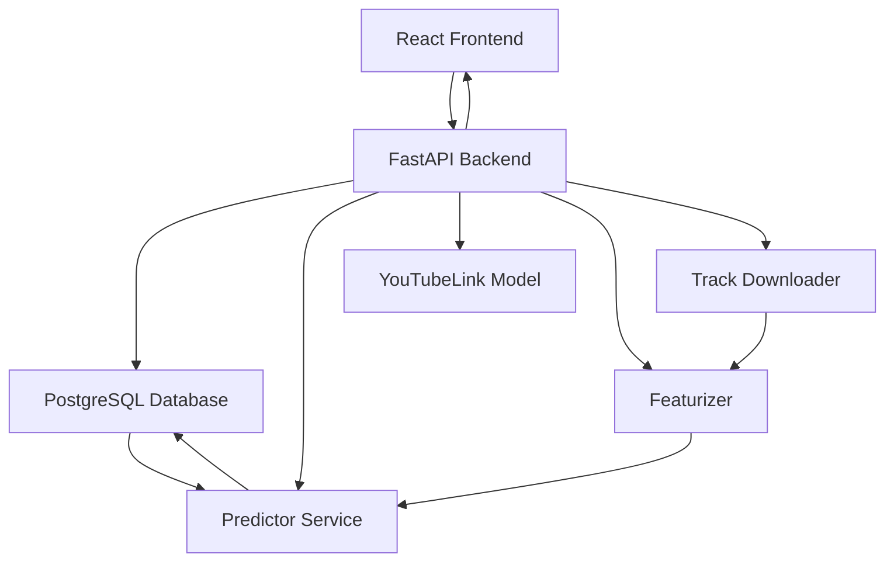

# ProperBot

## Introduction

Hello! If you are reading this then you probably came here through my CV, or you just have a weird fascination for my personal projects and spend a lot of time stalking people's github on the internet (get a life sheesh..). As much as I would love to say it, I can't honestly sit here and say, with a straight face that the only reason I built this app was to help out the music scene, which I love dearly (even though there's a lot of phony, shallow, full of themselves idiots in it who are only in it for the wrong reasons). I could also say that the only reason I built this is to help me and my friends moderate the r/ProperTechno subreddit, because we have to sift through 100s of tracks that people post on a daily basis that is absolute commercial TikTok techno garbage which belongs on that swampfest of a subreddit r/Techno, but that's not entirely true either. 
The main reason I built this is because I like being employed and I know companies like candidates who build shit, so I wanted to show you guys that I indeed, can build shit. But only if it's for something I trulu care about (or something that my employer who pays me to build shit wants me to build, totally onboard with that too).

So strap in, and enjoy the most entertaining README you've read all year. If you're a recruiter, and you're reading this, I hope this should be more than enough to convince you that I know how to code. No need to make me reverse a string or implement a linked list in a live coding interview for god's sake. If you came here from the subredddit, don't ever say we don't try to make the sub a better place. I've spent hours on this. It's still shit, but it's something. Anyways, enough (poorly written and unnecessarily vulgar) comedy. Let's actually get into the meat and potatoes.

## Application Overview

The application is a simple website that uses an ML model to automatically assign a score to each track posted in the r/ProperTechno subreddit. The score describes how likely the track fits the vibe of proper techno. The frontend was built using React, the backend ML model wrapper was built using FastAPI, and the model was trained using scikit-learn. The model was trained using a custom dataset of 1000+ proper techno tracks (downloade thanks to the community spotify playlist and some clandestine libraries that can download tracks directly from streaming services) and 1000+ non-proper techno tracks which I collected from random Techno playlists on spotify that were obviously not 'Proper Techno'. It is a binary classification model that predicts whether a track is proper techno or not.

I plan to extend this in the future and create a Reddit bot that will automatically score the tracks posted in the subreddit in a comment under the post. I have no plans of actioning any direct moderation action using this score, unless the model is really good, then I can probably have it automatically delete or flag posted tracks that don't have a high enough score so us moderators can focus on more important things, like banning trolls and spammers. 

the first iteration of the ML model is using very simple features on the audio data, I will be adding more rich features and improving the model in the near future, but I've got a job and a jiu jitsu career that also needs my focus and attention. So it is what it is. 

## System Architecture Diagram
Add system architecture diagram of Backend and frontend of website..

For the website, I used a FastAPI backend and a React frontend, and a PostgreSQL database. The database is used to cache the features of submitted tracks so that we don't have to download the audio every time we want to score a track. The reddit bot implementation is TBD.

Here is a diagram of the system architecture:

### FastAPI Backend
Entry Point: The FastAPI application serves as the entry point for requests from the frontend. It exposes an endpoint /predict/ that accepts a YouTube link and returns a prediction score.

### Predictor Service

#### Functionality
The predict function is the core of the prediction process. It checks if the track's features are already cached in the database. If not, it downloads the track, extracts features, and stores them in the database.

#### Interactions
- Database: It interacts with the database to check for cached features and to store new features.
- Track Downloader: It uses the download_track function to download audio from a YouTube link.
- Featurizer: It uses the extract_features function to process the downloaded audio and extract relevant features.
- Model: It uses a pre-trained model to predict the score based on the extracted features.

### Database Service

#### Functionality
This service handles all interactions with the PostgreSQL database. It initializes the database and provides functions to insert and retrieve track features.

#### Interactions
- Predictor Service: It is used by the predictor service to cache and retrieve track features.

### Featurizer

#### Functionality
The extract_features function processes audio files to extract various audio features like MFCCs, chroma, spectral contrast, etc.

#### Interactions
- Predictor Service: It is called by the predictor service to extract features from downloaded audio tracks.

### Track Downloader
#### Functionality
This component is responsible for downloading audio tracks from YouTube links. It is likely implemented in the download_track function, which is used by the predictor service.

#### Overall Flow
- Request Handling: The FastAPI backend receives a request with a YouTube link.

- Prediction Process:
    - The predictor service checks the database for cached features.
    - If not cached, it downloads the track using the track downloader.

It extracts features using the featurizer.
    - It stores the features in the database.
    - It predicts the score using the pre-trained model.

- Response: The prediction score is returned to the frontend.

This architecture design ensures efficient processing by caching features, so we don't have to rescore tracks that have already been scored, and modularizing the functionality into distinct services.

### Future Work
- Implement a Reddit bot that will automatically score the tracks posted in the subreddit in a comment under the post.
- Add more rich features to the model to improve the score.
- Deploy the app using streamlit so that it can be accessed by anyone.

## Dataset Details

To gather the data, I utilized the community spotify playlist for r/ProperTechno and then sourced some negative examples from a variety of other Techno playlists on spotify which seem to not be 'Proper Techno', falling more into the Dark/Hard Techno category, which is not Proper.

1. Positive cases: Proper Techno spotify playlist -> https://open.spotify.com/playlist/0E6pf5W3NV7armcJYfNK3H?si=826f2122a6b843c8 (1680 downloaded tracks on 05/03/23)
2. Negative cases: 
    - DARK /HARD TECHNO: https://open.spotify.com/playlist/1jjzhb9ublCl3X6ZZ6X9kK?si=3ea2988e0b1443e8 (517 total, 480 downloaded tracks)
    - RAMMEN MET https://open.spotify.com/playlist/40sr5LCPiqKjlwY0d1DvSH?si=477f9136d8b040c5 (448 total, 432 downloaded tracks)
    - TECHNO BEUKERS https://open.spotify.com/playlist/0NniF8WNSTeACw0eKSjCxy?si=c088c0c084c4455f (473 total, 421 downloaded tracks)
    - TECHNO BEUKERS 2 https://open.spotify.com/playlist/7bnISLKE70XyqclMAsgOyP?si=26a3e9de85dc4057 (244 total, 231 downloaded tracks)
    - Verknipt Hard Techno https://open.spotify.com/playlist/4k1vyKLTFNf8gIMPuFoGpm?si=e0bff84d3de448dd (148 total, 147 downloaded tracks)
    - HARD TECHNO RAVE 2024 https://open.spotify.com/playlist/6hYusBiBM0YAbiv6SpAXQi?si=916387357850414c (185 total, 180 downloaded tracks)
    - GYM HARD TECHNO https://open.spotify.com/playlist/6vMivq3dVG4PA8cP3r6ElD?si=80a79f2e54164ced (279 total, 239 downloaded tracks)

The playlists were downloaded and stored on my hard drive. Further processing was carried out using python to ensure that there were no duplicate tracks between the playlists in the same category. In addition, I also made sure we had no tracks that were in the positive case playlist in the negative case playlists. 

The matching was done using file metadata in a first pass which removed x amount of tracks. Then I used a audio fingerprinting to flag any potential escapees, which removed another y amount of tracks. 

After the initial cleaning step, we are left with the following breakdown:

| Class          | Playlist       | Number of Tracks | Downloaded Tracks | Average Track Length (min) | Unique Artists |
|----------------|----------------|------------------|----------------|----------------------------|---------------|
| Proper Techno  | r/ProperTechno  |  1680 (5th March 2023)| 1680      |                            |               |
| Not Proper  | Dark/Hard Techno | 517               | 480             |                            |                |
| Not Proper  | Rammen Met     |     448             | 432             |                            |               |
| Not Proper  | Techno Beukers     |  473               | 421             |                            |               |
| Not Proper  | Techno Beukers 2 | 244        | 231             |                            |               |
| Not Proper  | Hard Techno Rave 2024 |  185              | 180              |                            | -             |
| Not Proper  | Gym Hard Techno     | 279              | 239              |                            | -             |

## Installation
TBC..